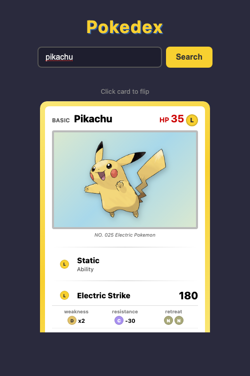

# Pokedex

A Pokemon trading card viewer built with Go and vanilla HTML/CSS/JS.

Search for any Pokemon and see it displayed as a TCG-style card with a 3D flip animation — the front shows the card with artwork, abilities, and moves, and the back shows detailed base stats.



## Features

- Pokemon TCG card design with type-colored borders
- 3D card flip animation (click to flip)
- Base stats with animated stat bars on the back
- Weakness, resistance, and retreat cost
- Official Pokemon artwork

## Run It

```bash
git clone https://github.com/paulhorton12/Pokemonv2.git
cd Pokemonv2
go run main.go
```

Open [http://localhost:8080](http://localhost:8080) and search for a Pokemon (e.g. `pikachu`, `charizard`, `mewtwo`).

You can also link directly to a Pokemon: [http://localhost:8080#charizard](http://localhost:8080#charizard)

## Tech Stack

- **Backend:** Go + [Echo](https://echo.labstack.com/) framework
- **Frontend:** Vanilla HTML/CSS/JS (single file, no build step)
- **Data:** [PokeAPI](https://pokeapi.co/)
